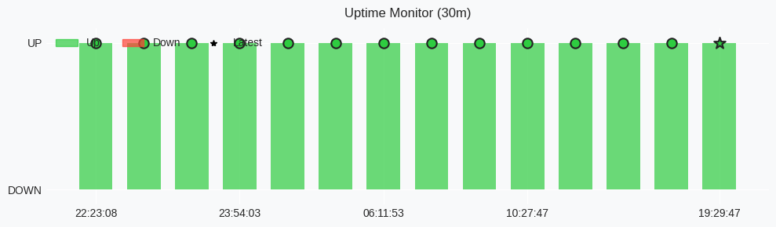

# 🚦 Render Service Status

<!--badge-start-->

<!--badge-end-->

**Monitoring:** `telegram-template-bot.onrender.com`

| Metric | Value |
|:--|:--|
| ⏰ Last Update | 2025-09-28 08:39:57 UTC |
| 🔄 Total Pings | 16 |
| ✅ Uptime (30 lần gần nhất) | 100.00% |
| ⌛ Ping Interval | 30 phút |
| 📡 Last Check | |

## 📊 Uptime Chart
 
<picture>
<source media="(prefers-color-scheme: dark)" srcset="uptime_chart.png">
<source media="(prefers-color-scheme: light)" srcset="uptime_chart.png">

</picture>
 

📝 Lịch sử Ping (30 lần gần nhất)

<!--ping-log-start-->
| Thời gian | Trạng thái | Chi tiết |
|---|---|---|
| 2025-09-27 22:36:10 | ✅ Success | Timeout/Connection Error (Thử lại 1/5), đợi 5s...
200 OK (Khởi động thành công sau 2 lần thử, phản hồi: 35413ms) |
| 2025-09-27 23:12:19 | ✅ Success | Timeout/Connection Error (Thử lại 1/5), đợi 5s...
200 OK (Khởi động thành công sau 2 lần thử, phản hồi: 35582ms) |
| 2025-09-27 23:35:11 | ✅ Success | 200 OK (Phản hồi: 22560ms) |
| 2025-09-28 01:11:23 | ✅ Success | Timeout/Connection Error (Thử lại 1/5), đợi 5s...
200 OK (Khởi động thành công sau 2 lần thử, phản hồi: 35449ms) |
| 2025-09-28 02:50:52 | ✅ Success | Timeout/Connection Error (Thử lại 1/5), đợi 5s...
200 OK (Khởi động thành công sau 2 lần thử, phản hồi: 35887ms) |
| 2025-09-28 03:35:20 | ✅ Success | Timeout/Connection Error (Thử lại 1/5), đợi 5s...
200 OK (Khởi động thành công sau 2 lần thử, phản hồi: 35414ms) |
| 2025-09-28 04:16:17 | ✅ Success | Timeout/Connection Error (Thử lại 1/5), đợi 5s...
200 OK (Khởi động thành công sau 2 lần thử, phản hồi: 35924ms) |
| 2025-09-28 04:40:13 | ✅ Success | 200 OK (Phản hồi: 22598ms) |
| 2025-09-28 05:13:04 | ✅ Success | Timeout/Connection Error (Thử lại 1/5), đợi 5s...
200 OK (Khởi động thành công sau 2 lần thử, phản hồi: 35521ms) |
| 2025-09-28 05:37:15 | ✅ Success | Timeout/Connection Error (Thử lại 1/5), đợi 5s...
200 OK (Khởi động thành công sau 2 lần thử, phản hồi: 35335ms) |
| 2025-09-28 06:19:20 | ✅ Success | Timeout/Connection Error (Thử lại 1/5), đợi 5s...
200 OK (Khởi động thành công sau 2 lần thử, phản hồi: 52410ms) |
| 2025-09-28 06:44:30 | ✅ Success | Timeout/Connection Error (Thử lại 1/5), đợi 5s...
200 OK (Khởi động thành công sau 2 lần thử, phản hồi: 35299ms) |
| 2025-09-28 07:12:06 | ✅ Success | Timeout/Connection Error (Thử lại 1/5), đợi 5s...
200 OK (Khởi động thành công sau 2 lần thử, phản hồi: 35715ms) |
| 2025-09-28 07:34:26 | ✅ Success | Timeout/Connection Error (Thử lại 1/5), đợi 5s...
200 OK (Khởi động thành công sau 2 lần thử, phản hồi: 35332ms) |
| 2025-09-28 08:16:36 | ✅ Success | Timeout/Connection Error (Thử lại 1/5), đợi 5s...
200 OK (Khởi động thành công sau 2 lần thử, phản hồi: 35397ms) |
| 2025-09-28 08:39:19 | ✅ Success | Timeout/Connection Error (Thử lại 1/5), đợi 5s...
200 OK (Khởi động thành công sau 2 lần thử, phản hồi: 35515ms) |
<!--ping-log-end-->

---

⚡️ Powered by [telebot-monitor](https://github.com/vhd0/telebot-monitor) | 🕒 Cập nhật mỗi 30 phút

