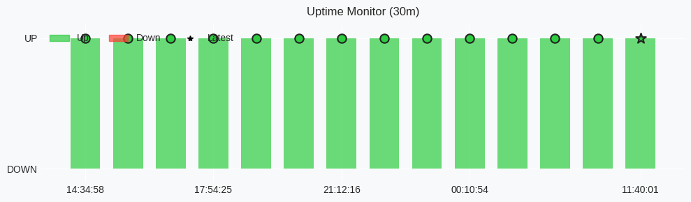

# 🚦 Render Service Status

<!--badge-start-->

<!--badge-end-->

**Monitoring:** `telegram-template-bot.onrender.com`

| Metric | Value |
|:--|:--|
| ⏰ Last Update | 2026-03-07 14:48:11 UTC |
| 🔄 Total Pings | 13 |
| ✅ Uptime (30 lần gần nhất) | 100.00% |
| ⌛ Ping Interval | 30 phút |
| 📡 Last Check | |

## 📊 Uptime Chart
 
<picture>
<source media="(prefers-color-scheme: dark)" srcset="uptime_chart.png">
<source media="(prefers-color-scheme: light)" srcset="uptime_chart.png">

</picture>
 

📝 Lịch sử Ping (30 lần gần nhất)

<!--ping-log-start-->
| Thời gian | Trạng thái | Chi tiết |
|---|---|---|
| 2026-03-06 22:53:42 | ✅ Success | Timeout/Connection Error (Thử lại 1/5), đợi 5s...
200 OK (Khởi động thành công sau 2 lần thử, phản hồi: 35392ms) |
| 2026-03-06 23:22:37 | ✅ Success | 200 OK (Phản hồi: 22522ms) |
| 2026-03-06 23:48:29 | ✅ Success | Timeout/Connection Error (Thử lại 1/5), đợi 5s...
200 OK (Khởi động thành công sau 2 lần thử, phản hồi: 35343ms) |
| 2026-03-07 06:32:57 | ✅ Success | Timeout/Connection Error (Thử lại 1/5), đợi 5s...
200 OK (Khởi động thành công sau 2 lần thử, phản hồi: 35334ms) |
| 2026-03-07 08:53:33 | ✅ Success | Timeout/Connection Error (Thử lại 1/5), đợi 5s...
200 OK (Khởi động thành công sau 2 lần thử, phản hồi: 35763ms) |
| 2026-03-07 09:23:19 | ✅ Success | Timeout/Connection Error (Thử lại 1/5), đợi 5s...
200 OK (Khởi động thành công sau 2 lần thử, phản hồi: 57472ms) |
| 2026-03-07 09:49:46 | ✅ Success | Timeout/Connection Error (Thử lại 1/5), đợi 5s...
200 OK (Khởi động thành công sau 2 lần thử, phản hồi: 42809ms) |
| 2026-03-07 10:46:47 | ✅ Success | Timeout/Connection Error (Thử lại 1/5), đợi 5s...
Timeout/Connection Error (Thử lại 2/5), đợi 8s...
200 OK (Khởi động thành công sau 3 lần thử, phản hồi: 92986ms) |
| 2026-03-07 11:15:08 | ✅ Success | Timeout/Connection Error (Thử lại 1/5), đợi 5s...
Timeout/Connection Error (Thử lại 2/5), đợi 8s...
200 OK (Khởi động thành công sau 3 lần thử, phản hồi: 73088ms) |
| 2026-03-07 12:35:04 | ✅ Success | Timeout/Connection Error (Thử lại 1/5), đợi 5s...
200 OK (Khởi động thành công sau 2 lần thử, phản hồi: 58372ms) |
| 2026-03-07 13:34:48 | ✅ Success | Timeout/Connection Error (Thử lại 1/5), đợi 5s...
Timeout/Connection Error (Thử lại 2/5), đợi 8s...
200 OK (Khởi động thành công sau 3 lần thử, phản hồi: 72941ms) |
| 2026-03-07 14:18:54 | ✅ Success | Timeout/Connection Error (Thử lại 1/5), đợi 5s...
Timeout/Connection Error (Thử lại 2/5), đợi 8s...
200 OK (Khởi động thành công sau 3 lần thử, phản hồi: 72910ms) |
| 2026-03-07 14:46:57 | ✅ Success | Timeout/Connection Error (Thử lại 1/5), đợi 5s...
Timeout/Connection Error (Thử lại 2/5), đợi 8s...
200 OK (Khởi động thành công sau 3 lần thử, phản hồi: 73043ms) |
<!--ping-log-end-->

---

⚡️ Powered by [telebot-monitor](https://github.com/vhd0/telebot-monitor) | 🕒 Cập nhật mỗi 30 phút

